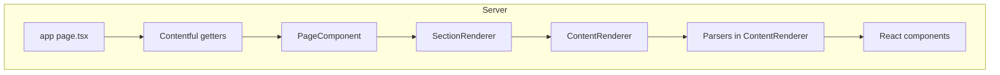

# Architecture

Map of the Delmarva site: technologies, where code lives, and how a request moves from the App Router layout down to a single Contentful-driven block.

## Tech stack

- **Framework**: Next.js 16 with the **App Router**. Routes live under `src/app/`; locale-aware pages under `src/app/[locale]/`.
- **UI**: React 19, TypeScript.
- **CMS**: Contentful. Generated types in `src/contentful/types/`; getters and parsers in `src/contentful/`.
- **i18n**: **next-intl** with routing in [src/i18n/routing.ts](../../src/i18n/routing.ts), messages in [src/i18n/messages/](../../src/i18n/messages/), and server config in [src/i18n/request.ts](../../src/i18n/request.ts).
- **Client data**: TanStack **React Query** in [src/app/providers.tsx](../../src/app/providers.tsx); form mutations in [src/hooks/mutations/](../../src/hooks/mutations/).
- **Styling**: **CSS Modules** (`.module.css`) plus global styles in [src/styles/globals.css](../../src/styles/globals.css).
- **Tooling**: pnpm, Biome (lint/format), Jest.

## Directory map

### `src/app/`

- **`[locale]/layout.tsx`** — Root layout for localized routes: `html` `lang`, optional **Google Tag Manager** ([`GoogleTagManager`](https://nextjs.org/docs/app/building-your-application/optimizing/third-party-libraries#google-tag-manager)), draft-mode banner, **NextIntlClientProvider**, and **Providers** (React Query, locale, toaster). Preconnects for Mapbox (when configured), Contentful images, YouTube.
- **`[locale]/page.tsx`** — Home: fetches page, navigation, footer from Contentful, renders **PageLayout** with **PageComponent** (and **SchemaScript** for JSON-LD where used).
- **`[locale]/[slug]/page.tsx`**, **`[locale]/what-we-deliver/`**, **`[locale]/markets/[slug]/page.tsx`** — Other static routes; each follows the same general pattern (validate locale, `draftMode()`, fetch Contentful, render).
- **`[locale]/refresh-content/page.tsx`** — On-demand revalidation flow (protected by env token).
- **`api/`** — Route handlers: **draft** ([`api/draft/route.ts`](../../src/app/api/draft/route.ts)), **disable-draft** ([`api/disable-draft/route.ts`](../../src/app/api/disable-draft/route.ts)), **Resend** email endpoints under `api/resend/`, **Mapbox boundaries** under `api/boundaries/`.
- **`manifest.ts`**, **`robots.ts`**, **`opengraph-image.alt.txt`**, **`twitter-image.alt.txt`** — Metadata and PWA-related files.

API details: [platform.md](platform.md). Tags: [integrations.md](integrations.md).

### `src/components/`

One folder per feature component (often **PascalCase** with **`<Name>.component.tsx`** and **`<Name>.module.css`**). Many folders include a **README** with usage notes.

Structural pieces:

- **[Page.component.tsx](../../src/components/Page/Page.component.tsx)** — Exports **PageComponent**: async server component that runs **SectionRenderer** on the page’s **sections** (after optional filters like stale recent-news handling).
- **[PageLayout.component.tsx](../../src/components/PageLayout/PageLayout.component.tsx)** — Navigation, main, footer layout.
- **[SectionRenderer.component.tsx](../../src/components/SectionRenderer/SectionRenderer.component.tsx)** — Maps parsed sections to **Section** and, for each content entry, **ContentRenderer**.
- **[ContentRenderer.component.tsx](../../src/components/ContentRenderer/ContentRenderer.component.tsx)** — Switches on Contentful `contentType.sys.id`, runs the matching parser, renders the UI (imports heavy pieces from the registry).
- **[ContentRendererRegistry.tsx](../../src/components/ContentRenderer/ContentRendererRegistry.tsx)** — `next/dynamic` imports for CMS-backed components (`server-only`).

### `src/contentful/`

- **Client**: [client.ts](../../src/contentful/client.ts) exports **`contentfulClient`** used by getters.
- **Getters**: e.g. [getPages.ts](../../src/contentful/getPages.ts), [getNavigation.ts](../../src/contentful/getNavigation.ts), [getFooter.ts](../../src/contentful/getFooter.ts), [getContentRecentNews.ts](../../src/contentful/getContentRecentNews.ts)—most wrap fetches with **`cached()`** from [cache.ts](../../src/contentful/cache.ts) and keys from [cacheKeys.ts](../../src/contentful/cacheKeys.ts).
- **Parsers**: `parse*.ts` files normalize entries for React.
- **Types**: `src/contentful/types/` — generated; run `pnpm types:contentful` with Contentful CMA env set.

Details: [contentful.md](contentful.md).

### `src/app/providers.tsx`

Client **QueryClientProvider**, **LocaleProvider**, **Sonner** toaster, and a class **ErrorBoundary** around the tree.

### `src/atoms/`

**Jotai** atoms (e.g. project modal). See [source-layout.md](source-layout.md).

### `src/hooks/`

Custom hooks (modal, theme, scroll, mutations). See [src/hooks/README.md](../../src/hooks/README.md).

### `src/api/`

- **[urls.ts](../../src/api/urls.ts)** — `api` object: form submissions and related `fetch` calls to App Router API routes.
- **[helpers.ts](../../src/api/helpers.ts)** — Shared fetch options.

### `src/lib/`

- **[generateRss.ts](../../src/lib/generateRss.ts)**, **[generateSitemap.ts](../../src/lib/generateSitemap.ts)** — RSS/XML helpers writing under `public/` where invoked.
- **[analytics.ts](../../src/lib/analytics.ts)** — GTM `dataLayer` helpers.
- Email template docs: [src/lib/README.md](../../src/lib/README.md).

### `src/utils/`

Page metadata, schema, Contentful helpers, URL/env helpers, etc. Overview: [source-layout.md](source-layout.md).

### `src/ui/`

Lower-level primitives (Button, TextField, TextArea) used by feature components.

### `public/`

Static assets, **sitemap-index.xml**, generated sitemap fragments when builds run `outputSitemap`.

## Data flow

1. **Request** hits a **Server Component** page under `src/app/[locale]/…`.
2. **Locale** is validated and fixed for next-intl (`validateAndSetLocale`, `setRequestLocale`).
3. **Draft mode** is read from `next/headers` when editors preview unpublished content.
4. **Getters** load page, navigation, footer (and route-specific data) from Contentful.
5. **PageLayout** wraps **PageComponent** (and other children); **PageComponent** renders **SectionRenderer** with parsed **sections** and their **content** entries.
6. **ContentRenderer** dispatches on content type ID, runs the **parser**, and renders the component from the **registry** (often code-split with `dynamic`).

## Config and deployment

- **[next.config.ts](../../next.config.ts)** — `env` exposure, `headers` (cache + security), `images.remotePatterns`, redirects, webpack/turbopack (e.g. SVGR).
- **CI**: [`.github/workflows/ci.yml`](../../.github/workflows/ci.yml) — `tsc:ci`, `lint:ci`, `test:ci`.

More: [platform.md](platform.md).

## Further reading

| Topic | Doc |
|-------|-----|
| CI, env, CSP, draft routes | [platform.md](platform.md) |
| GTM / data layer | [integrations.md](integrations.md) |
| RSS, sitemaps, metadata images | [distribution.md](distribution.md) |
| Atoms, utils, lib | [source-layout.md](source-layout.md) |
